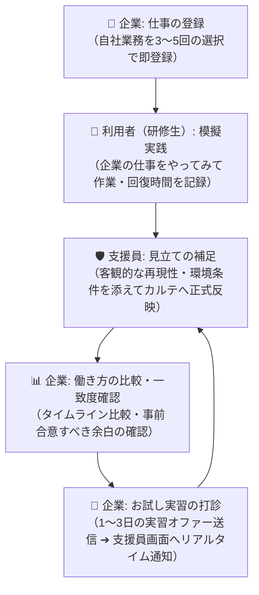

# RAMP デジタルスキルダッシュボード (PoC プロトタイプ)

**「人を仕事に合わせるのではなく、人と仕事がつながる条件で探す。」**

浜松市「ソリューションピッチ＆ミートアップイベント（2026/09/01開催）」登壇ソリューション  
就労移行支援における「持続可能な作業周期」と企業要件の双方向接続ダッシュボード

* リポジトリ: https://github.com/takehisa-nanba/RAMP_skills.git
* 完全オフライン設計（外部CDN・外部フォント・外部API通信ゼロ）

---

## 1. このシステムの中核コンセプト

本システムは、**採用の合否判定や自動マッチングを行うものではありません**。

就労移行支援の現場で観測された、

* 本人が安定して力を発揮できる「集中作業＋回復」の周期
* 作業時間・成果量・品質の観測幅（ムラ）
* 安定して再現するために必要な環境、指示方法、セルフケア

と、企業の具体的な業務要件（想定時間・許容上限・期待成果量・用意できる配慮）の双方を**同一スケールで可視化**し、
安定して就労できる条件を事前に合意するための**「対話ツール・働き方の設計図」**です。

> **✕「この人には何ができないか（欠点や障害の判定）」**  
> 　ではなく  
> **◯「この人は、どのような条件・時間配分・環境であれば、御社にとってかけがえのない人財になり得るか」**

---

## 2. 三者循環デモフロー（体験の主役）

本システムは、単なる一方通行の情報閲覧ではなく、**企業・利用者・支援員の3者が循環して「働き方の合意」を形成するプロセス**をデモ体験できます。



1. **企業が仕事を登録する**:
   * 自由記述不要の完全選択式UI（STEP A基本 ＋ STEP B詳細アコーディオン）。
   * 3〜5回のタップで想定時間・成果量・重視条件を登録可能。未回答は勝手に補完せず「企業条件として未確認（事前相談事項）」として客観的に扱います。
2. **利用者（研修生）が実際にやってみて記録する**:
   * 企業が登録した仕事が研修生画面に即時届き、「この仕事をやってみる」から作業時間（例: 20分）、回復時間（例: 10分）、使用した自己対処をワンタッチで記録。
3. **支援員が客観的見立てを補足してカルテに反映する**:
   * 支援員画面に届いた実践記録に対し、現場での再現性や必要な環境（手順書完備、静かな席など）を添えて正式カルテ（`workCycles`）へ反映。
4. **企業が一致度と余白を体感する**:
   * 企業の想定時間と本人の作業・回復周期が同一ピクセルスケールで描画され、早く終わった時間を追加ノルマとせず「回復や待機のために事前に合意すべき余白」として可視化。
5. **お試し実習（1〜3日）の打診**:
   * 比較結果をもとに企業がオファーを送信すると、支援員画面トップおよび該当研修生のカルテカードへリアルタイムに通知が届きます。

---

## 3. 主な機能と設計原則

1. **持続可能な作業周期（ワークサイクル）の同一スケール比較**:
   * 「集中作業時間（観測幅） ＋ 回復時間」を不可欠な業務工程として提示。
   * 企業の目標想定時間および許容上限時間と並列で可視化します。
2. **「余白時間」の事前合意表現**:
   * 想定より早く業務が完了した場合の時間を、自動追加ノルマとせず「回復・待機・準備として何に使うかを事前に合意する余白枠」として点線枠で提示。
3. **透明な3分類の提示（自動適合率・点数の完全排除）**:
   * 採用合否や適合率〇％などのブラックボックス判定を一切行わず、「🟢 すでに重なる条件」「🟡 調整で接続できる条件」「⚪ まだ不足している情報（お試し実習での確認事項）」の3つの客観的事実のみを対話的に提示。
4. **一般就労標準型を含む5名のモデルケース**:
   * Aさん（事務DX・20分集中＋10分回復）
   * Bさん（デザイン・45分集中＋15分回復）
   * Cさん（手順書作成・30分集中＋10分回復）
   * Dさん（文書校正・25分集中＋5分回復）
   * Eさん（一般事務・50分集中＋3分回復 / 2〜3時間に1度5分休憩の一般就労標準型）
5. **来場企業からの需要検証データ管理 & CSV出力**:
   * イベント中に送信された「お試し実習・面談オファー」「求めるスキルリクエスト」「体験アンケート感想」を蓄積。
   * BOM付きUTF-8のCSVとしてワンクリックでエクスポート可能。
6. **システム側での一発完全リセット（UIからの管理ボタン撤去）**:
   * 支援員画面から開発寄りの復元ボタンを撤去し、ヘッダーメニューの「初期状態に戻す」または URL `?reset=true` / コンソール `window.resetAllData()` でいつでも初期シード状態へ安全に完全復元。
7. **1366×768ノートPCでのスクロール不要完全収容**:
   * 展示会場の標準的なノートPC解像度（1366×768）でも、スクロールすることなく全要素・操作ボタンが1画面内に収まるタイトなレイアウト設計。

---

## 4. ディレクトリ構成

```
ramp_skills/
├── src/
│   ├── types/
│   │   └── index.ts                 # 全データモデル型定義（要件、実践記録、オファー等）
│   ├── data/
│   │   └── seed.ts                  # ルーブリック6軸、モデルケース5名、初期業務要件、初期オファー
│   ├── lib/
│   │   ├── comparison.ts            # 透明なルールに基づく3分類接続分析ロジック
│   │   └── storage.ts               # LocalStorage永続化、三者循環反映、BOM付きCSVエクスポート
│   ├── components/
│   │   ├── charts/
│   │   │   ├── WorkCycleChart.tsx   # 作業・回復・余白の同一スケール比較タイムライン
│   │   │   └── SkillRadarChart.tsx  # 6軸レーダーチャート（合意到達点 vs 自己評価）
│   │   ├── modals/
│   │   │   └── AboutSystemModal.tsx # 【統一】システムコンセプト＆3つの安心注記モーダル
│   │   ├── ui/
│   │   │   └── SlimHeader.tsx       # 1段スリム固定ヘッダー（3視点横並び切替、全リセット）
│   │   └── views/
│   │       ├── CompanyExperienceView.tsx # 【主役】体験型企業画面（自社業務選択/登録、人財比較、オファー）
│   │       ├── TraineeView.tsx      # 研修生画面（企業の仕事一覧、模擬実践記録、振り返り）
│   │       └── SupporterView.tsx    # 支援員画面（新着オファー確認、実践記録カルテ反映、需要CSV管理）
│   └── app/
│       ├── globals.css              # オフライン完結Tailwindスタイル
│       ├── layout.tsx               # アプリケーション共通レイアウト
│       └── page.tsx                 # 3視点をシームレスに切り替えるメインページ
├── package.json
├── tsconfig.json
├── tailwind.config.js
├── next.config.js
└── README.md
```

---

## 5. 起動手順（完全オフライン対応）

```bash
# 依存関係のインストール (初回のみ)
npm install

# 本番用ビルドの作成
npm run build

# サーバー起動 (完全オフライン環境で即座に起動可能)
npm run start
# => ブラウザで http://localhost:3000 にアクセス
```

※ 開発用サーバーで起動する場合:
```bash
npm run dev
```

---

## 6. デモ操作ガイド（ピッチ・展示での活用シナリオ）

ヘッダー右側の**【3つの横並びボタン】**から、いつでも視点を切り替えられます。

### シナリオA: 企業として体験する（ピッチ・展示ブースのメイン導線）
1. **開始画面（STEP 0）**:
   * タイピング演出で「人を仕事に合わせるのではなく、人と仕事がつながる条件で探す。」が表示。
   * 「御社の仕事を選んで試す」をクリック。
2. **仕事を選ぶ（STEP 1）**:
   * 「領収書データ入力」「Webバナー画像制作」などから選択、または「＋ 自社の仕事を新しく入力する」から選択式で3タップ登録。
3. **人財を見る（STEP 2）**:
   * 登録業務と合致する模擬実績を持つ人財（Aさん〜Eさん）を一覧表示。「働き方を比較する」をクリック。
4. **働き方を比較する（STEP 3・中核画面）**:
   * 企業の想定時間・許容上限と、本人の集中作業時間・回復時間・余白が同一スケールで並ぶタイムラインを確認。
   * 「💡 デモ体験: Aさんがこの業務を実際にやってみた記録をカルテに反映してみる」ボタンで、実践と見立てがカルテに反映される連動をその場で体感。
5. **対話へ進む（STEP 4）**:
   * 「1〜3日のお試し実習を相談する」ボタンからオファーを送信。

### シナリオB: 支援員・研修生の視点を確認する
1. **支援員視点へ切り替え**:
   * トップに企業から届いた**「📨 実習オファー・面談打診」**がリアルタイムに表示されていることを確認。
   * 研修生から届いた実践記録に「支援員見立て」を添えてカルテへ反映。
   * 「需要検証データ管理」タブから来場企業のオファー・アンケートをCSV出力。
2. **研修生視点へ切り替え**:
   * 「🏢 企業から届いた募集業務」一覧から仕事を選び、「この仕事をやってみる」で集中作業時間・回復時間・自己対処を記録。

---

## 7. 開発・管理者向け保守機能

* **初期シードへの完全リセット**:
  * ヘッダーの「⚙️ メニュー ➔ 表示を初期状態に戻す」
  * またはブラウザURLに `http://localhost:3000/?reset=true` でアクセス
  * またはブラウザの開発者コンソールで `window.resetAllData()` を実行
